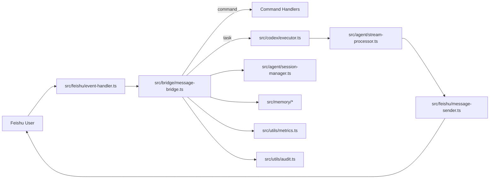
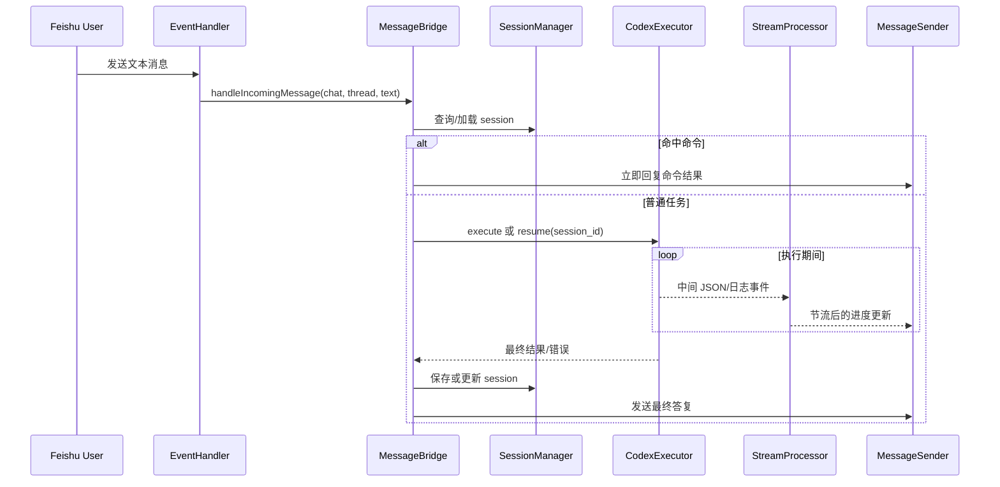
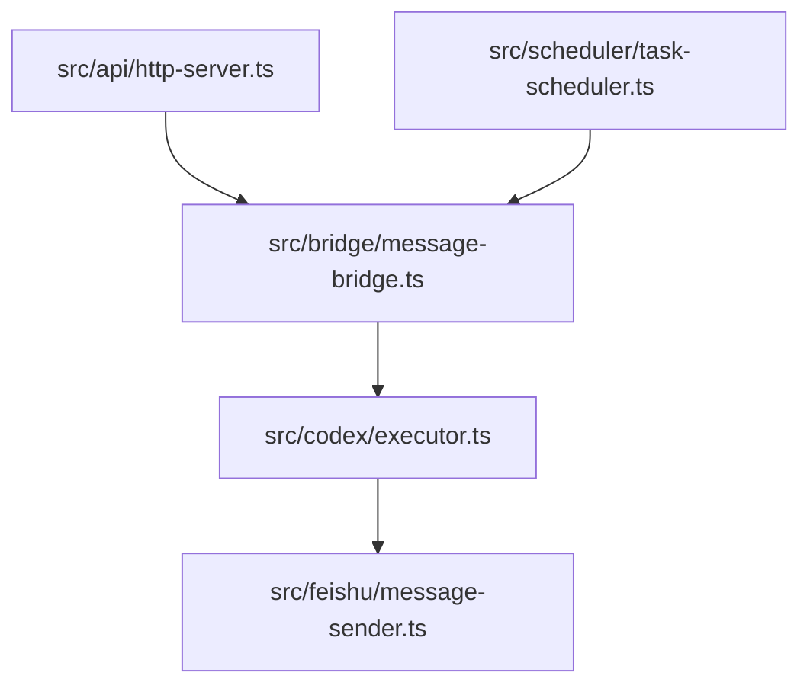

# codexbot 流程与时序

> 目标：用流程图和时序图说明消息如何在系统内流动，以及关键状态点在哪里。

## 1. 端到端主流程

## 2. 关键时序（普通任务）

## 3. `codex exec` 执行路径

在 `src/codex/executor.ts` 中：

1. 构造命令行参数（`--json`、`--full-auto`、`--cd`、`--output-last-message`）
2. 启动子进程并监听 stdout/stderr
3. 解析 JSON 行事件（如 `thread.started`）
4. 结束后读取输出文件，提取最终消息
5. 将最终状态回交给 bridge 层

恢复会话时使用：`codex exec resume <session_id> ...`。

## 4. 命令流与控制流

`MessageBridge` 在入队前先判定是否为控制命令：

- `/help`：返回帮助信息
- `/status`：返回当前运行状态
- `/stop`：取消当前运行中的任务
- `/reset`：重置会话上下文
- `/memory ...`：记忆读写/管理

命令路径通常短路，不进入 Codex 执行流程。

## 5. 队列与并发策略

- 默认按 chat/thread 维度串行执行任务
- 避免同一上下文并发导致状态互相覆盖
- 队列状态由 bridge 维护，执行状态由 executor 回传

## 6. 超时、取消与错误

- 超时：任务超时后统一失败收敛
- 取消：`/stop` 触发 abort/终止子进程
- 错误：bridge 层做统一用户可读化回包，同时记录 metrics/audit

## 7. API 与调度的外部触发路径

说明：

- API 与 Scheduler 不直接调用 Feishu 回包，而是复用 bridge + executor 统一链路
- 这样可保持一致的审计、指标和会话行为

## 8. 状态落盘点

- `SessionManager`：会话映射落盘到 `~/.codexbot`
- `TaskScheduler`：调度任务落盘到 `~/.codexbot/scheduled-tasks.json`
- 技能安装器：从 `~/.codex/skills` 同步到项目 `.codex/skills`

## 9. 观测点建议

建议在以下节点持续检查：

1. 入站事件吞吐与失败率（EventHandler）
2. 队列长度与等待时长（MessageBridge）
3. `codex exec` 平均耗时与错误分类（Executor）
4. 飞书回包失败率与重试结果（MessageSender）
5. 调度触发成功率与漂移（Scheduler）
